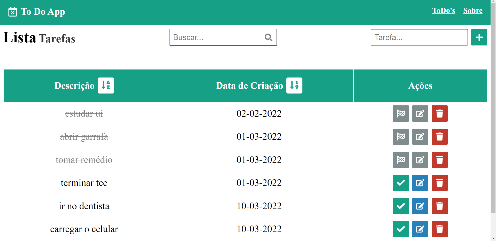

# To Do App

<!---Esses são exemplos. Veja https://shields.io para outras pessoas ou para personalizar este conjunto de escudos. Você pode querer incluir dependências, status do projeto e informações de licença aqui--->





> To Do App é uma aplicação de listagem de tarefas a realizar. Neste App podemos cadastrar tarefas a serem realizadas, editar elas, excluir, marcar como realizada, buscar por nome uma tarefa desejada e ordenar as tarefas por ordem alfabética e por ordem de data de criação.

## 💻 Pré-requisitos

Antes de começar, verifique se você atendeu aos seguintes requisitos:
* Você possui o `Node Js` instalado em sua máquina?
* Você possui o `MongoDB` instalado em sua máquina?

## 🚀 Instalando To Do App

Para instalar o To Do App, siga estas etapas:

Abra o prompt de comando e inicie o mongo:
```
mongod
```
Abra outro prompt e navegue até a pasta do projeto, depois:
```
cd backend 
```
```
npm install
```
Volte a pasta raiz do projeto, e:
```
cd frontend
```
```
npm install
```

## ☕ Usando To Do App

Para usar To Do App, siga estas etapas:

Na raiz do projeto, execute no terminal:
```
cd backend 
```
```
npm run dev
```
Volte a raiz do projeto, e:
```
cd frontend 
```
```
npm run start
```

Fique à vontade para contribuir!
